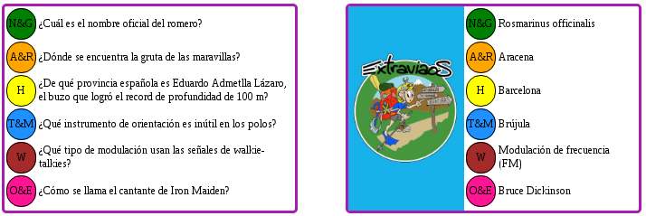

### TRIVGEN



The trivgen is a small script to generate a single HTML document with custom
trivial questions.

It digest several input files with your questions and your answers organiced
in categories.

The main benefit of using trivgen is that you can easily focus on designing
the cards with CSS.

## Datafiles

The format of the datafiles is:

```
 CATEGORY_NAME
 
 1Q: Question 1
 1A: Answer 1
 
 2Q: Question 2
 2A: Answer 2
```

You should have a datafile per category, for example:

 * category 1: nature
 * category 2: sports
 * category 3: history
 * category 4: geography
 * category 5: adventure

All datafiles must have the same number of lines and the same number of
questions.

You may use the `format.sh` script to preformat datafiles.

### Example usage

The following call will generate 100 trivial cards in 5 categories in the
output file `trivial.html`.

```
./trivgen.sh -c5 -C100 --data cat1.txt --data cat2.txt --data cat3.txt \
		--data cat4.txt --data cat5.txt -o trivial.html
```

### Limitations

This script was wrote in a single afternoon, quick and dirty. It does the work
but is very very slow because I abused reading the datafiles inside for loops.
